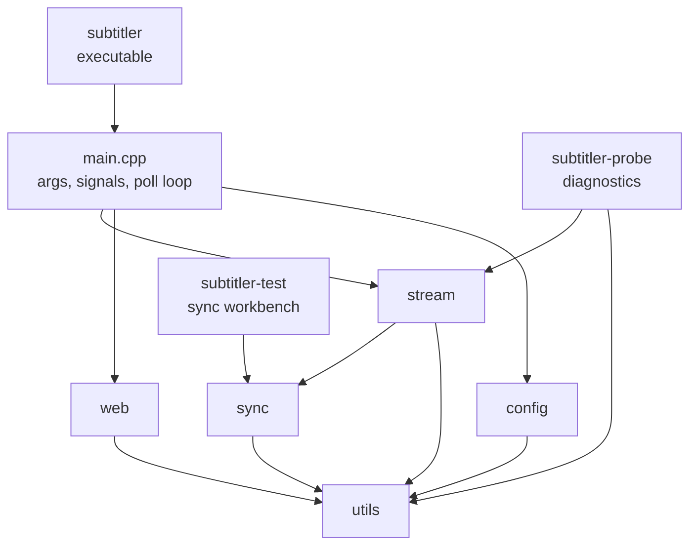
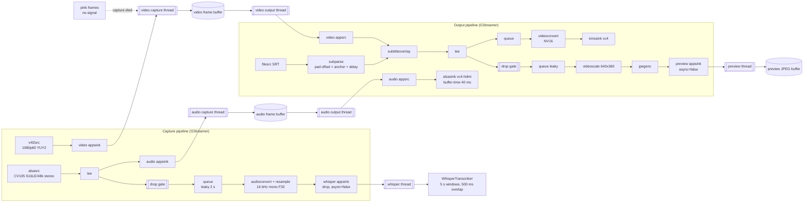
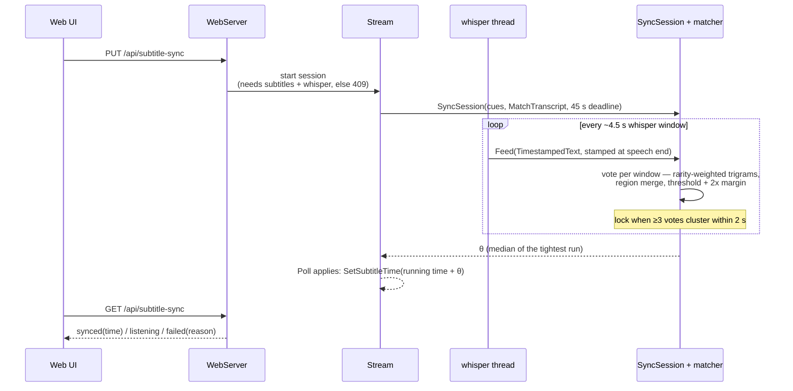

# Architecture

subtitler is a single-process appliance: it captures 1080p60 video and
48 kHz stereo audio from a V4L2/ALSA HDMI capture device (CV105), and
re-emits them on the Pi's HDMI output via DRM/KMS with SRT subtitles
composited in real time. A built-in web server (port 8080, trusted LAN,
no authentication) provides the controls: subtitle library and style,
whisper transcription, one-shot auto-sync, and an MJPEG preview.

This document is the map. The how-to is in the README; hardware specifics
in `docs/pi-setup.md`, the output/preview design in `docs/video-output.md`,
the HTTP surface in `docs/rest-api.md`, and the sync matcher in
`docs/sync-matching.md`.

## Modules

The executable composes small static libraries under `src/`; all headers
are private and live next to their sources.

- **`stream`** — the two GStreamer pipelines, the worker threads, the
  frame buffers between them, the subtitle overlay controls, and the
  whisper tap (`WhisperTranscriber` wraps whisper.cpp; stubbed out when
  `SUBTITLER_ENABLE_WHISPER=OFF`).
- **`web`** — the libsoup server. `WebServer` is lifecycle only
  (SoupServer + GMainContext + io thread); each feature area is a route
  module, and everything the routes need from the rest of the process
  arrives as a `WebServerHooks` struct of `std::function`s filled by
  main.cpp — an unset hook disables its endpoints. The web lib never
  includes GStreamer headers.
- **`sync`** — subtitle-auto-sync matching: tolerant SRT parsing, the
  one-shot session state machine, and the rarity-weighted trigram
  matcher. No GStreamer, so `subtitler-test` links it alone and
  exercises exactly the production code.
- **`config`** — the persistent INI (GLib GKeyFile): validated load with
  per-key recovery, atomic write-back.
- **`utils`** — header-only shared code (logging, RAII helpers, the
  preview frame buffer, XDG paths, the subtitle library store).
  Dependency-free by rule.

External dependencies: GStreamer + GLib (`stream`), libsoup (`web`),
pangocairo (font enumeration in `stream`), whisper.cpp (FetchContent,
`stream`), ALSA + libdrm (`subtitler-probe`).

## Runtime: pipelines, threads, buffers

The appliance runs two GStreamer pipelines — capture and output —
decoupled by app-owned frame buffers, so the output side renders
whatever the buffer holds even when the capture side has died (the
pink no-signal fallback). Both pipelines share one timeline (pinned
system clock, common base time): captured PTS are valid output
timestamps, latency is computed automatically, and in-flight buffering
is time-sized (appsrc `max-time` 300 ms) so the render schedule can't
starve the sources.

Notes on the non-obvious parts:

- **Drop gates** are pad-probe buffer droppers on the tee branches that
  are off most of the time (MJPEG preview, whisper tap). A `valve`
  can't do it (it fails serialized queries while dropping, stalling
  pipeline-wide latency computation), and each gated appsink needs
  `async=false` so a starving gated branch can't hold the whole
  pipeline in preroll. Every tee branch gets its own queue.
- **The whisper branch** exists whenever audio is enabled and whisper
  is compiled in; enabling swaps the `WhisperTranscriber` under an
  `atomic<shared_ptr>` and flips the gate — no pipeline rebuild.
- **Subtitle positioning**: cue time *t* renders at
  `anchor + delay + t` via a pad offset on the subparse src pad
  (anchor = output running time when the output started). The offset
  reaches only cues parsed after the change, so seeks, pauses, and
  delay trims re-anchor and flush-seek the filesrc back to the start —
  subparse re-emits every cue through the new offset.
- **Output backends**: the diagram shows the default `software` chain
  (videoconvert → NV16 → kmssink; no vc4 plane scans out packed 4:2:2,
  so conversion is mandatory). `pisp`/`window`/`null` swap the sink
  chain; the rest is unchanged.
- **Preview encoding** runs only while a web client is connected (the
  gate drops everything otherwise); with nothing encoded yet, the
  endpoints serve a seeded magenta placeholder.

Threads: video capture, audio capture, whisper, video output, audio
output, preview (all `std::jthread` inside `Stream`), the web server's
io thread, and the main thread's poll loop, which drains the bus,
recalculates latency on demand, applies pending sync locks, and exits
the process non-zero on unrecoverable failure so the service manager
restarts the appliance.

## Subtitle auto-sync

One-shot by design: the web API starts a session, the whisper thread
feeds it, and the matcher votes until ≥3 windows agree within 2 s —
fail loudly, never lock wrong.

Details and the improvement roadmap live in `docs/sync-matching.md`.
The session cancels on subtitle switch, manual seek, whisper disable,
or capture stop; the deadline rides the shared timeline so whisper
toggles can't strand it.

## State and configuration

- **Config** (`$XDG_CONFIG_HOME/subtitler/config.ini`): every
  command-line option plus the web-API subtitle style state and the
  whisper enabled/model state. Loaded with validation (bad keys dropped
  with a warning, malformed file refused wholesale), written back
  atomically (temp file + rename) on web-API changes.
- **State dir** (`$XDG_STATE_HOME/subtitler/`): the subtitle library
  (`subtitles/<first-letter>/<title>`), the `active` marker for boot
  resume, and the whisper model store (`models/*.bin`, browser-driven
  downloads through the API — never auto-downloaded).

## Concurrency rules worth knowing

- Mutex order: `sync_mutex_` is always taken **after** `mutex_` /
  `whisper_mutex_`, never before; the whisper thread takes no locks
  (its lock is applied by the poll loop, since teardown joins the
  thread while holding `mutex_`).
- Hot-swappable collaborators (transcriber, transcript callback) are
  `atomic<shared_ptr>` the whisper thread copies per window.
- GStreamer objects are held with the RAII deleters in
  `src/stream/deleters.h`; transfer-none references use `GstView<T>`.
